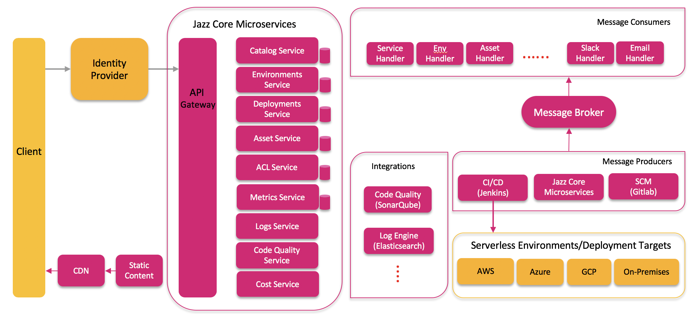

#  Jazz Serverless Development Platform

**Seamlessly build, deploy & manage cloud-native serverless applications!**

## Introduction

Jazz, a serverless development platform, accelerates adoption of serverless technology within your enterprise. Jazz comes with a beautiful UI that lets developers quickly create serverless applications with a click of a button. Its modular design makes it easy to add new integrations that your enterprise needs.

## Overview

* **Services** - As of today, Jazz can help build functions, APIs and static websites. Fully customizable template-based design makes it easy for admins to define new ones and expose them as services to the developers. Jazz also supports [Serverless Framework](https://github.com/serverless/serverless) and developers can leverage its rich ecosystem to build serverless apps. Support for [AWS SAM](https://github.com/awslabs/serverless-application-model) will be coming soon!
* **Deployment Targets** - Currently, Jazz can deploy to AWS & Azure. Developers can select their target  cloud provider during service creation and Jazz will orchestrate the provisioning in the respective public cloud. GCP support will be available in the near future.
* **CI/CD** - Jazz comes with CI/CD by default. It creates a code repository for each service, assigns appropriate permissions and adds a web hook to trigger build/deployment workflows whenever it sees a commit. We leverage [Jenkins](https://github.com/jenkinsci/jenkins) open source for the build process and [Serverless Framework](https://github.com/serverless/serverless) for deploying these services.
* **One-Click Development Environments** - Jazz automatically creates a new dedicated development environment for each git branch in the service repository. This allows parallel development in a multi-developer team without a hitch! Jazz takes care of deleting these environments once the branch gets deleted.
* **Security Controls** - Centralized platform allows administrators to define & apply security controls from a single place through Jazz. Admins can choose to enforce the controls on every service that gets created using Jazz allowing them to make them secure by default. Many best practices like applying the principle of least privilege, code (& dependency) scans during CI/CD, preventing default public access are available by default in Jazz.
* **Extensions** - Jazz is designed to integrate and work well with other systems that your enterprise needs. You can check out our optional extensions like Azure, Slack, Splunk, Apigee etc. Centralized configuration helps Jazz admins to easily enable/disable these features as per their needs.
* **Multiple Accounts & Regions** - Jazz's multi account/region extension allows you to add support for multiple accounts & regions to an existing Jazz stack. Developers can simply select the target account & region from the UI to deploy their services. Admins can add/remove new accounts/regions to the stack with ease.
* **Other Features** - Jazz comes with many useful integrations like SCM (Gitlab/Bitbucket), monitoring (CloudWatch), logging (ElasticSearch), authentication (Cognito), access controls, code quality metrics (SonarQube) by default.
* **Utilities** - Jazz comes with many utilties that allow admins to monitor, govern and report the usage of serverless services through Jazz environment.

Jazz is [open-sourced](http://opensource.t-mobile.com) and under active development by T-Mobile's Cloud Center of Excellence.

[Watch the video preview here.](https://www.youtube.com/watch?v=6Kp1yxMjn1k)

## User Guide

For complete user guide, see our [wiki](https://github.com/tmobile/jazz/wiki).

## Architecture

Following is the high level logical architecture of Jazz.

## Installation

You can [install Jazz](https://github.com/tmobile/jazz-installer) in your AWS account using the automated installer.

## Try Jazz!

You can try out public preview version of Jazz by registering with your email address [here](http://try.tmo-jazz.net). You will need a registration code which can be requested by joining [slack](https://tmo-oss-getinvite.herokuapp.com/).

## Platform Development

### Branching/Release Strategy

1. Breaking/nontrivial features first go into named feature branches cut from `develop`
2. When/if a feature branch is chosen to be included in the next release, it is merged into `develop`
3. Release testing happens in `develop`
4. When confirmed/vetted, `develop` is merged into `master`, and `master` becomes the current release.
5. Small fixes explicitly intended for the next release can be PRed directly into `develop` without first needing a feature branch.

tl;dr `master` is always the current release, `develop` is always the current state of the next release. If you want to contribute a PR, we recommend you fork and work in a branch off of `develop`, then PR against `develop`. Project owners will move you into a feature branch if they deem it necessary.

## License

Jazz is released under the [Apache 2.0 License](https://github.com/tmobile/jazz/blob/master/LICENSE)
